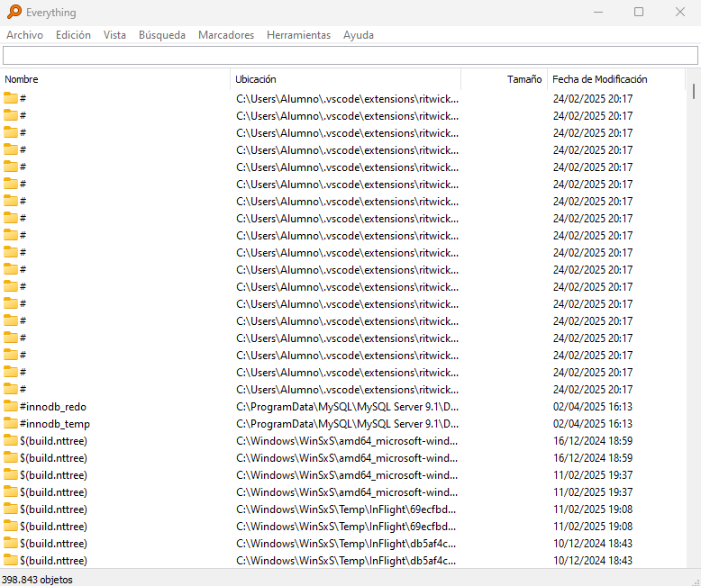

## Everything

- Everything es una herramienta de búsqueda ultrarrápida para Windows, su objetivo principal es ayudarte a encontrar archivos y carpetas en tu computadora de manera instantánea. Ideal si necesitas localizar archivos rápidamente sin depender de la búsqueda predeterminada de Windows.  

  

- Para instalarlo solo tendremos que ir a la página oficial y descargar la aplicación.
[Página oficial](https://www.voidtools.com/es-es/)  

- Una vez ejecutemos la aplicación y haya aceptado el acuerdo y condiciones podremos utilizar la herramienta y hacer busqueda de cualquier archivo en el buscador.  

