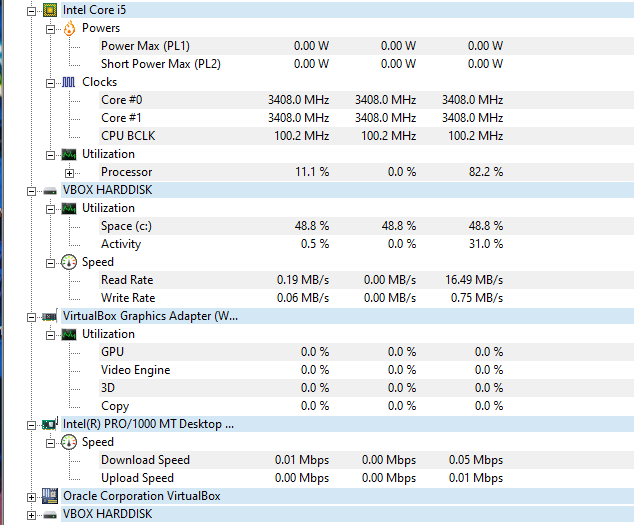

## HWMonitor

- HWMonitor es una herramienta gratuita que sirve para monitorear el hardware de tu ordenador Es utilizada para observar parámetros como la temperatura de la CPU, la GPU, los discos duros, la velocidad de los ventiladores, el voltaje y otros datos importantes relacionados con el rendimiento de tu equipo.  

  

- Para instalarlo solo tendremos que ir a la página oficial y descargar la aplicación.
[Página oficial](https://www.cpuid.com/softwares/hwmonitor.html)  

- Una vez ejecutemos la aplicación y haya aceptado el acuerdo y condiciones podremos utilizar la herramienta y empezar a monitorear los diferentes componentes de nuestro ordenador.  

