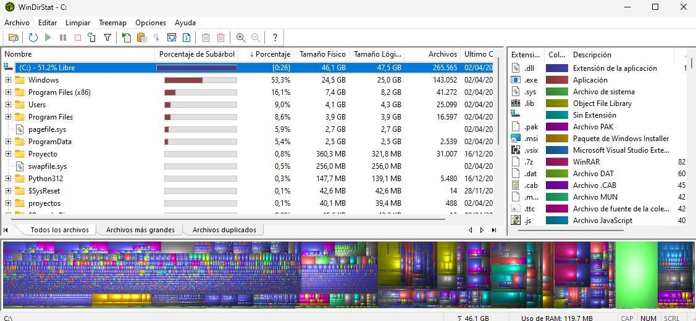

## WinDirStat

- WinDirStat es una herramienta gratuita que permite analizar el uso del disco en tu computadora y visualizarlo de manera gráfica. Cuando ejecutas WinDirStat, este escanea tu disco duro para gestionar el espacio de almacenamiento y encontrar archivos innecesarios que ocupen mucho espacio.  

  

- Para instalarlo solo tendremos que ir a la página oficial y descargar la aplicación.
[Página oficial](https://windirstat.net/download.html)  

- Una vez ejecutemos la aplicación y haya aceptado el acuerdo y condiciones podremos utilizar la herramienta y empezar a visualizar el espacio que ocupa cada carpeta de forma amigable y sencilla de entender.  

